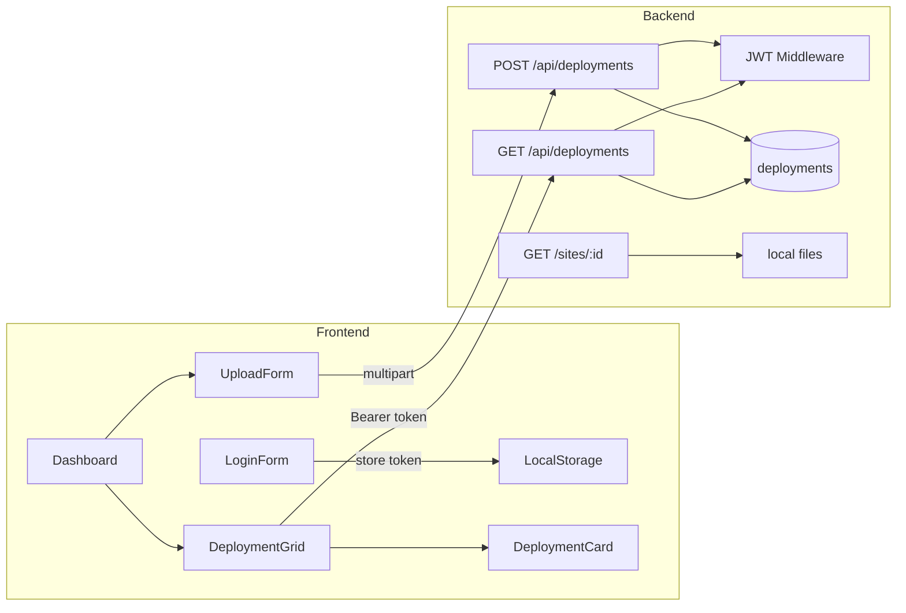

# Dashboard with Deployment Cards

## Current State

The project has auth (signup/signin) and shadcn UI primitives, but **no deployment schema, no deployment API, and an empty** [`frontend/src/pages/Dashboard.jsx`](frontend/src/pages/Dashboard.jsx). The planned deployment model exists only in [`learn/CONTEXT.md`](learn/CONTEXT.md) (lines 249–261). Auth is incomplete for a dashboard: login returns a JWT but does not store it or redirect, and [`backend/middleware/auth.controller.js`](backend/middleware/auth.controller.js) is empty.



## Phase 1: Deployment Schema (Backend — prerequisite)

Create [`backend/types/deploymentSchema.js`](backend/types/deploymentSchema.js) following the existing Zod pattern in [`backend/types/userSchema.js`](backend/types/userSchema.js).

**MongoDB `deployments` collection document shape:**

| Field | Type | Notes |
|-------|------|-------|
| `deploymentId` | string | Short UUID (URL slug, e.g. `a1b2c3d4`) |
| `userId` | ObjectId | Owner — links deployment to authenticated user |
| `status` | enum | `pending` \| `ready` \| `failed` |
| `fileKey` | string | Local path: `deployments/{id}/index.html` |
| `subdomain` | string | Same as `deploymentId` for Phase 1 |
| `publicUrl` | string | e.g. `http://localhost:3001/sites/{id}` |
| `fileName` | string | Original uploaded HTML filename |
| `createdAt` | Date | |
| `updatedAt` | Date | |

Export a Zod enum/helper for `status` validation on API responses and future updates.

## Phase 2: Auth Plumbing (Backend + Frontend)

**Backend** — implement JWT verification in [`backend/middleware/auth.controller.js`](backend/middleware/auth.controller.js):
- Read `Authorization: Bearer <token>`
- Verify with `JWT_SECRET`, attach `req.user = { userId, email }`
- Return 401 if missing/invalid

**Fix JWT payload** in [`backend/routes/auth/signin.js`](backend/routes/auth/signin.js):
- Sign `{ userId: ExistingUser._id.toString(), email }` instead of including the password hash (current security bug)

**Frontend** — minimal auth helpers in new [`frontend/src/lib/auth.js`](frontend/src/lib/auth.js):
- `setToken`, `getToken`, `clearToken` via `localStorage`
- Update [`frontend/src/components/login-form.jsx`](frontend/src/components/login-form.jsx): on success, store token and `navigate("/dashboard")`

## Phase 3: Deployment API (Backend)

Create [`backend/routes/deployments.routes.js`](backend/routes/deployments.routes.js) and mount in [`backend/index.js`](backend/index.js).

### `POST /api/deployments` (protected, multipart)
- Reuse [`backend/middleware/upload.js`](backend/middleware/upload.js) (`upload.array("files", 2)`)
- Require HTML file; optional CSS
- Generate `deploymentId` via `crypto.randomUUID()` (first 8 chars)
- Write files to `backend/files/deployments/{id}/` using `fs` (memory storage from multer)
- Insert deployment doc with `status: "ready"` and computed `publicUrl` (Phase 1 synchronous — no queue yet)
- Return `{ deployment: { ... } }`

### `GET /api/deployments` (protected)
- Query `deployments` where `userId` matches `req.user.userId`
- Sort by `createdAt` descending
- Return `{ deployments: [...] }`

### `GET /sites/:deploymentId` (public)
- Serve `index.html` from local disk for the deployment URL
- Add `Cache-Control: public, max-age=31536000, immutable` per CONTEXT.md

Delete or replace the broken draft in [`backend/routes/uploads.routes.js`](backend/routes/uploads.routes.js) (wrong HTTP method, unmounted, references `req.file` incorrectly).

## Phase 4: Frontend API Layer

Create [`frontend/src/lib/api.js`](frontend/src/lib/api.js):
- Shared `fetch` wrapper that attaches Bearer token from `auth.js`
- `getDeployments()` → `GET /api/deployments`
- `createDeployment(files)` → `POST /api/deployments` as `FormData`

Fix signup URL inconsistency in [`frontend/src/components/signup-form.jsx`](frontend/src/components/signup-form.jsx): change `http://localhost:3000/signup` to `/api/` to match the Vite proxy.

## Phase 5: Deployment Card Component (Primary UI deliverable)

Create [`frontend/src/components/DeploymentCard.jsx`](frontend/src/components/DeploymentCard.jsx) using existing shadcn [`card.jsx`](frontend/src/components/ui/card.jsx).

**Card layout (dark shadcn tokens — consistent with login form):**

```
┌─────────────────────────────────────┐
│ [Status Badge]          [⋮ menu?]  │  ← icon + text, not color-only
│ my-site.html                        │  ← fileName (CardTitle)
│ abc123.localhost                    │  ← subdomain (CardDescription)
├─────────────────────────────────────┤
│ Deployed 2 hours ago                │  ← relative timestamp
│ [Open Site ↗]  [Copy URL]          │  ← 44px touch targets, lucide icons
└─────────────────────────────────────┘
```

**Status badge mapping** (lucide-react, not emoji):
- `pending` → `Loader2` (animated spin) + amber/muted badge
- `ready` → `CheckCircle2` + green badge
- `failed` → `XCircle` + destructive badge

Add shadcn `badge` component via CLI (`npx shadcn@latest add badge`) for status pills.

**Props:**
```js
{ deployment: { deploymentId, status, fileName, subdomain, publicUrl, createdAt } }
```

Interactions:
- "Open Site" — `window.open(publicUrl)` with `rel="noopener noreferrer"`
- "Copy URL" — `navigator.clipboard.writeText` + brief success feedback
- Disabled state when `status !== "ready"`

## Phase 6: Dashboard Page

Wire [`frontend/src/pages/Dashboard.jsx`](frontend/src/pages/Dashboard.jsx) and add route in [`frontend/src/App.jsx`](frontend/src/App.jsx).

**Page structure:**

1. **Header** — "Deployments" title + user email + logout button
2. **Upload section** — new [`frontend/src/components/UploadDeploymentForm.jsx`](frontend/src/components/UploadDeploymentForm.jsx)
   - Visible labels (HTML required, CSS optional)
   - File inputs with `accept=".html,.css"`
   - Submit button shows loading spinner + disabled during upload
   - Inline error below form on failure
   - On success: reset form + refresh deployment list
3. **Deployments grid** — new [`frontend/src/components/DeploymentGrid.jsx`](frontend/src/components/DeploymentGrid.jsx)
   - Responsive: `grid-cols-1 md:grid-cols-2 lg:grid-cols-3 gap-4`
   - Loading: skeleton cards (3 placeholders)
   - Empty state: message + hint to upload above
   - Maps deployments → `<DeploymentCard />`

**Auth guard** in Dashboard: if no token, redirect to `/login`.

Use [`frontend/src/layouts/RootLayout.jsx`](frontend/src/layouts/RootLayout.jsx) as the dashboard shell (`min-h-dvh bg-background`) via nested route in `App.jsx`.

## Design Decisions (ui-ux-pro-max)

- **Style:** Dark SaaS dashboard — shadcn semantic tokens (`bg-card`, `text-muted-foreground`, `ring-foreground/10`) over raw `gray-900` from Home page
- **Icons:** lucide-react only (Globe, ExternalLink, Copy, Loader2, etc.)
- **Accessibility:** Status uses icon + text label; form fields have visible labels; focus rings preserved on buttons
- **Interaction:** Upload button disabled + spinner during async; card actions ≥ 44px height
- **Animation:** `Loader2` spin for pending; `transition-colors duration-200` on hover states; respect `prefers-reduced-motion` for spinner

## Files to Create / Modify

| Action | File |
|--------|------|
| Create | `backend/types/deploymentSchema.js` |
| Implement | `backend/middleware/auth.controller.js` |
| Create | `backend/routes/deployments.routes.js` |
| Modify | `backend/index.js` (mount routes + static serve) |
| Modify | `backend/routes/auth/signin.js` (JWT payload fix) |
| Create | `frontend/src/lib/auth.js` |
| Create | `frontend/src/lib/api.js` |
| Create | `frontend/src/components/DeploymentCard.jsx` |
| Create | `frontend/src/components/DeploymentGrid.jsx` |
| Create | `frontend/src/components/UploadDeploymentForm.jsx` |
| Add | `frontend/src/components/ui/badge.jsx` (shadcn) |
| Implement | `frontend/src/pages/Dashboard.jsx` |
| Modify | `frontend/src/App.jsx` (dashboard route + layout) |
| Modify | `frontend/src/components/login-form.jsx` (token + redirect) |
| Modify | `frontend/src/components/signup-form.jsx` (API URL fix) |

## Out of Scope (Future Phases)

- Object storage (S3/R2), Redis queue, build worker
- Real subdomains (`*.yourdomain.com`) and CDN
- WebSocket/polling for async status updates
- Deployment delete/redeploy actions

## Test Plan

1. Sign up → log in → confirm redirect to `/dashboard` and token in localStorage
2. Upload an HTML file → card appears with `ready` status and correct `publicUrl`
3. Click "Open Site" → deployed HTML renders at `/sites/{id}`
4. Refresh dashboard → deployments persist and load via `GET /api/deployments`
5. Log out / clear token → dashboard redirects to `/login`
6. Empty state shows when user has no deployments
7. Verify responsive grid at 375px, 768px, and 1024px widths
